| Nama   | Sardin         |
| ------ | -------------- |
| NIM    | 312010135      |
| Kelas  | TI.20.A1       |
| Matkul | Pemograman web |

# Tugas Lab4Web

## Langkah Pertama

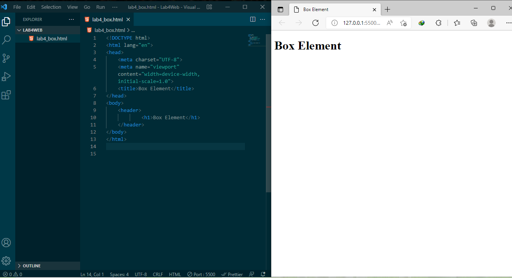

### Membuat Box Element

ini hasil setelah saya menambahkan kode untuk membuat box element hasilnya seperti ini.
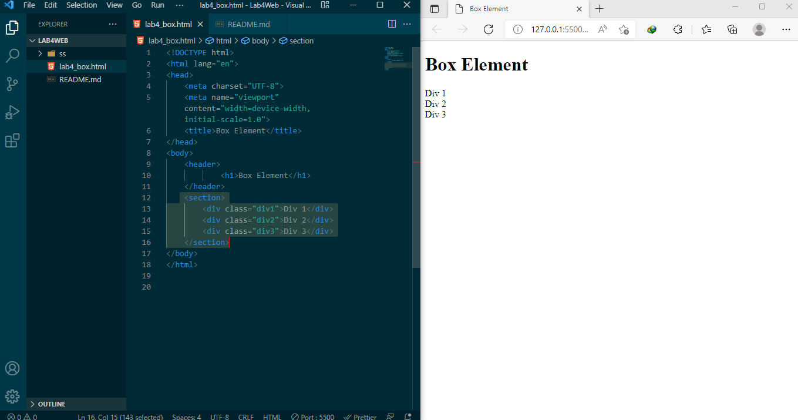

### Menambahkan CSS Float Property

Jadi ini hasilnya setelah saya Menambahkan deklarasi CSS pada head untuk membuat float element
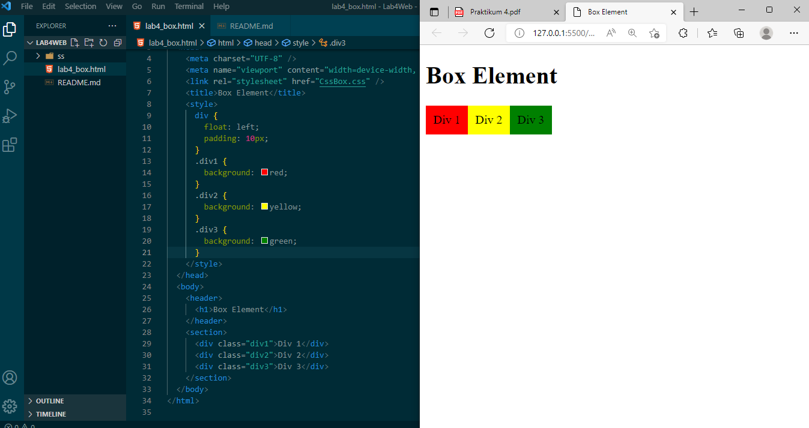

### Mengatur Clearfix Element

ini hasilnya
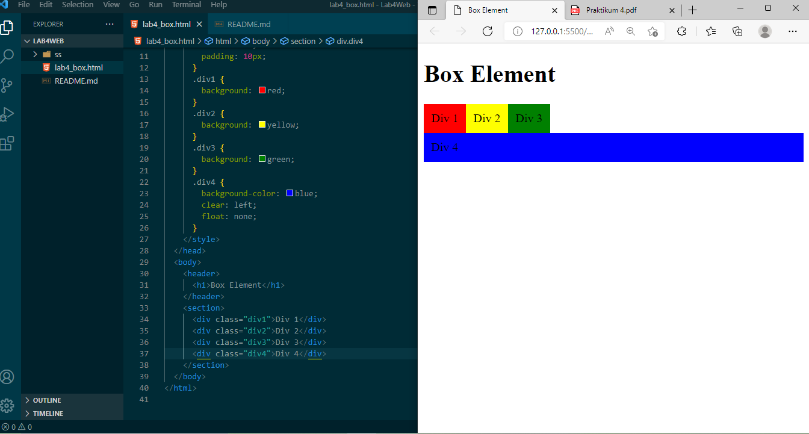

# Langakah Membuat Layout Sederhana

Hasil Langkah Pertama
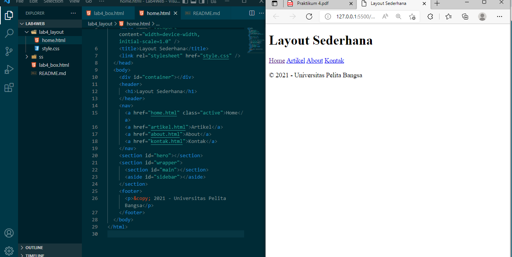
Ini hasil setelah saya menambhakkan kode CSS untuk membuat layoutnya
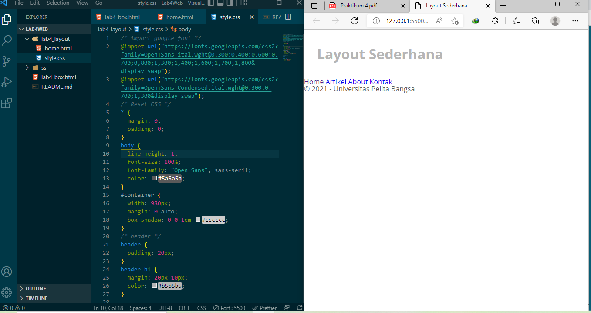

### Membuat Navigasi

setelah saya Mengatur navigasi ini hasilnya
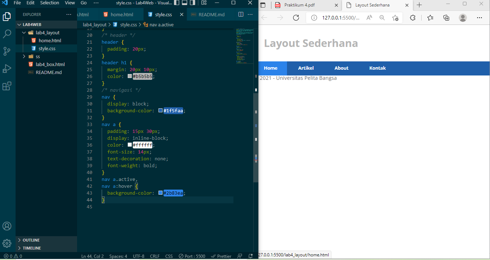

### Membuat hero panel

ini hasil setelah dijalankan
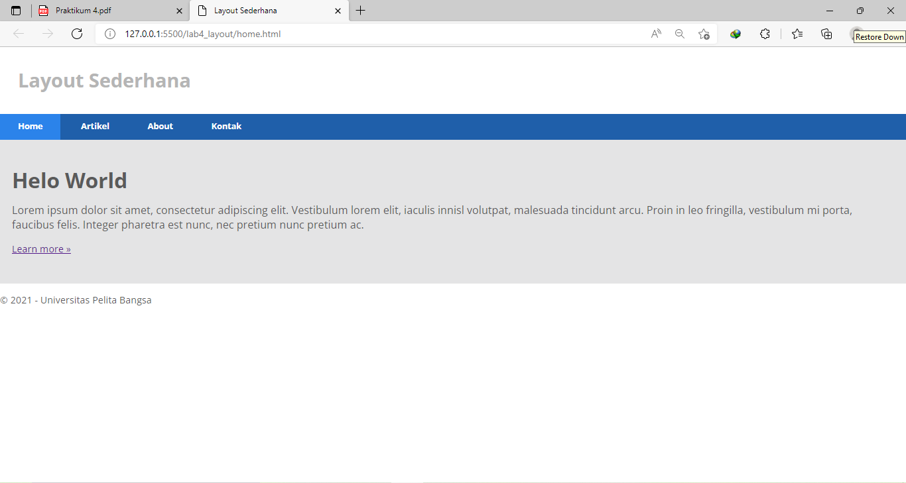

### Kodenya

```html
<section id="hero">
  <h1>Hello World!</h1>
  <p>
    Lorem ipsum dolor sit amet, consectetur adipiscing elit. Vestibulum lorem
    elit, iaculis innisl volutpat, malesuada tincidunt arcu. Proin in leo
    fringilla, vestibulum mi porta, faucibus felis. Integer pharetra est nunc,
    nec pretium nunc pretium ac.
  </p>
  <a href="home.html" class="btn btn-large">Learn more &raquo;</a>
</section>
```

````CSS
/* Hero Panel */
#hero {
 background-color: #e4e4e5;
 padding: 50px 20px;
 margin-bottom: 20px;
}
#hero h1 {
 margin-bottom: 20px;
 font-size: 35px;
}
#hero p {
 margin-bottom: 20px;
 font-size: 18px;
 line-height: 25px;
}```
````

### Membuat Sidebar Widget

Kemudian selanjutnya menambahkan element lain dalam sidebar.<br>
Hasilnya Setelah dijalankan
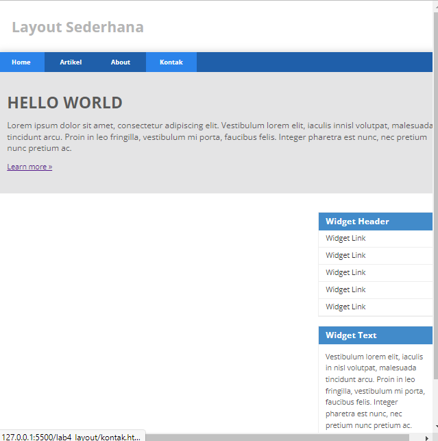

### kodenya

```Html
<div class="widget-box">
 <h3 class="title">Widget Header</h3>
 <ul>
 <li><a href="#">Widget Link</a></li>
 <li><a href="#">Widget Link</a></li>
 <li><a href="#">Widget Link</a></li>
 <li><a href="#">Widget Link</a></li>
 <li><a href="#">Widget Link</a></li>
 </ul>
 </div>
 <div class="widget-box">
 <h3 class="title">Widget Text</h3>
 <p>Vestibulum lorem elit, iaculis in nisl volutpat, malesuada tincidunt
arcu. Proin in leo fringilla, vestibulum mi porta, faucibus felis. Integer
pharetra est nunc, nec pretium nunc pretium ac.</p>
 </div>
```

```Css
/* widget */
.widget-box {
border:1px solid #eee;
margin-bottom:20px;
}
.widget-box .title {
padding:10px 16px;
background-color:#428bca;
color:#fff;
}
.widget-box ul {
list-style-type:none;
}
.widget-box li {
border-bottom:1px solid #eee;
}
.widget-box li a {
padding:10px 16px;
color:#333;
display:block;
text-decoration:none;
}
.widget-box li:hover a {
background-color:#eee;
}
.widget-box p {
padding:15px;
line-height:25px;
}
```

### Mengatur Footer

Ini hasilnya
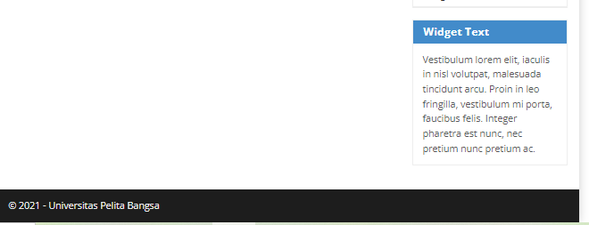

### kondenya

```Css
/* footer */
footer {
 clear:both;
 background-color:#1d1d1d;
 padding:20px;
 color:#eee;
}
```

### Menambahkan Elemen lainnya pada Main Content

ini hasilnya setelah dijalankan
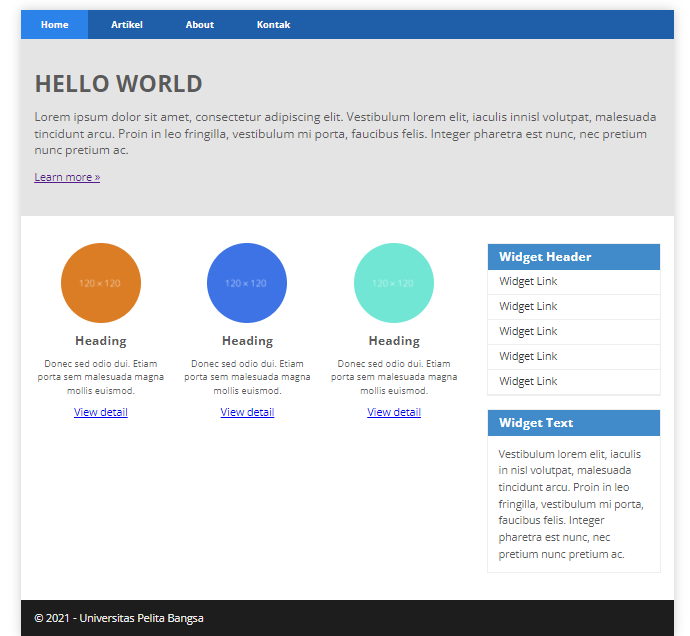

### kodenya

```Html
<div class="row">
 <div class="box">
 
 <h3>Heading</h3>
 <p>Donec sed odio dui. Etiam porta sem malesuada magna mollis
euismod.</p>
 <a href="#" class="btn btn-default">View detail</a>
 </div>
 <div class="box">
 
 <h3>Heading</h3>
 <p>Donec sed odio dui. Etiam porta sem malesuada magna mollis
euismod.</p>
 <a href="#" class="btn btn-default">View detail</a>
 </div>
 <div class="box">
 
 <h3>Heading</h3>
 <p>Donec sed odio dui. Etiam porta sem malesuada magna mollis
euismod.</p>
 <a href="#" class="btn btn-default">View detail</a>
 </div>
 </div>
```

```Css
/* box */
.box {
display:block;
float:left;
width:33.333333%;
box-sizing:border-box;
-moz-box-sizing:border-box;
-webkit-box-sizing:border-box;
padding:0 10px;
text-align:center;
}
.box h3 {
margin: 15px 0;
}
.box p {
line-height: 20px;
font-size: 14px;
margin-bottom: 15px;
}
box img {
border: 0;
vertical-align: middle;
}
.image-circle {
border-radius: 50%;
}
.row {
margin: 0 -10px;
box-sizing: border-box;
-moz-box-sizing: border-box;
-webkit-box-sizing: border-box;
}
.row:after, .row:before,
.entry:after, .entry:before {
content:'';
display:table;
}
.row:after,
.entry:after {
clear:both;
}
```
### Menambahkan Content Artikel
hasilnya setelah saya jalankan 
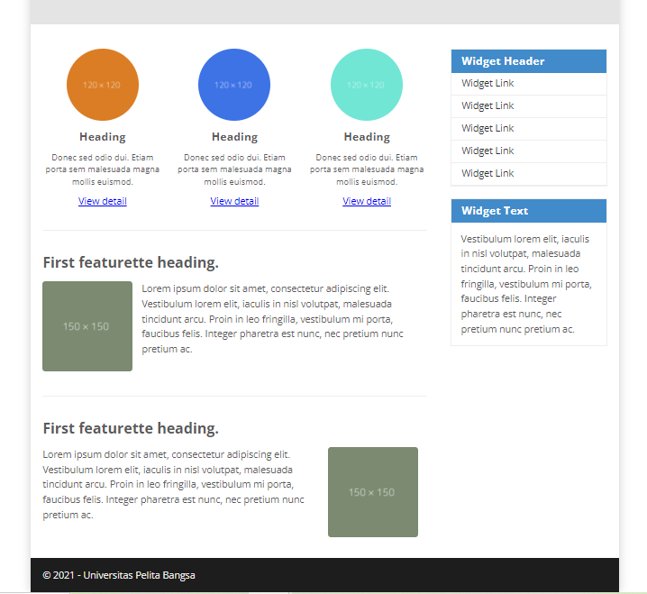
### kodenya
```Html
<hr class="divider" />
<article class="entry">
 <h2>First featurette heading.</h2>
 
 <p>Lorem ipsum dolor sit amet, consectetur adipiscing elit. Vestibulum lorem 
elit, iaculis in nisl volutpat, malesuada tincidunt arcu. Proin in leo fringilla, 
vestibulum mi porta, faucibus felis. Integer pharetra est nunc, nec pretium nunc 
pretium ac.</p>
</article>
<hr class="divider" />
<article class="entry">
 <h2>First featurette heading.</h2>
 
 <p>Lorem ipsum dolor sit amet, consectetur adipiscing elit. Vestibulum lorem 
elit, iaculis in nisl volutpat, malesuada tincidunt arcu. Proin in leo fringilla, 
vestibulum mi porta, faucibus felis. Integer pharetra est nunc, nec pretium nunc 
pretium ac.</p>
</article>
```
```Css
.divider {
 border:0;
 border-top:1px solid #eeeeee;
 margin:40px 0;
}
/* entry */
.entry {
 margin: 15px 0;
}
.entry h2 {
 margin-bottom: 20px;
}
.entry p {
 line-height: 25px;
}
.entry img {
 float: left;
 border-radius: 5px;
 margin-right: 15px;
}
.entry .right-img {
 float: right;
}
```
# Latihan
1. Tambahkan Layout untuk menu About
=> buat single layout yang berisi deskripsi, portfolio, dll
2. Tambahkan layout untuk menu Contact
=> yang berisi form isian: nama, email, message, dll

# Jawaban
1. Ini Hasil Jawabannya<br>
Html
```<div class="about">
			<div>
				<h1 class="title">About me</h1>
				<br>
				<p>Lorem ipsum dolor sit amet, consectetur adipisicing elit, sed do eiusmod
				tempor incididunt ut labore et dolore magna aliqua. Ut enim ad minim veniam,
				quis nostrud exercitation ullamco laboris nisi ut aliquip ex ea commodo
				consequat. Duis aute irure dolor in reprehenderit in voluptate velit esse
				cillum dolore eu fugiat nulla pariatur. Excepteur sint occaecat cupidatat non
				proident, sunt in culpa qui officia deserunt mollit anim id est laborum.</p><br>
			</div>
			<div>
				
			</div>
        </div>
```
Css
```/* layout About */
.about {
  display: flex;
  align-items: center;
  justify-content: space-between;
  background-color: #e4e4e5;
  clear: both;
  padding: 35px;
  line-height: 25px;
}

.avatar {
  width: 110px;
  border-radius: 50%;
}
```
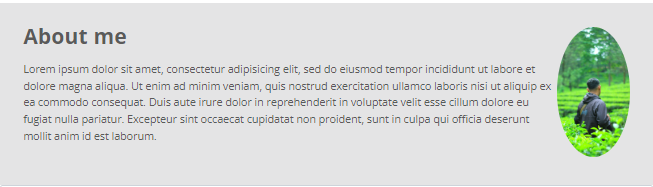<br>
2. Ini Hasilnya Jawabannya<br>
Html
```<div class="kontak-body">
            <h1>Contact</h1>
            <form class="kontak-form-class">
              <div class="kontak-form-group">
                <label for="Name" class="kontak-label">Nama</label>
                <div class="kontak-input-group">
                  <input type="text" id="Name" name="Name" class="kontak-form-control" required>
                </div>
              </div>
    
              <div class="kontak-form-group">
                <label for="Name" class="kontak-label">Email</label>
                <div class="kontak-input-group">
                  <input type="text" id="Name" name="Name" class="kontak-form-control" required>
                </div>
              </div>
    
              <div class="kontak-form-group">
                <label for="Message" class="kontak-label">Message</label>
                <div class="kontak-input-group">
                  <textarea id="Message" name="Message" class="kontak-form-control" rows="6" maxlength="3000" required></textarea>
                </div>
              </div>
    
              <div class="kontak-form-group">
                <button type="submit" class="kontak-btn kontak-btn-primary kontak-btn-lg kontak-btn-block">Send Message</button>
              </div>
            </form>
              </div>
```
Css
```/* Layout Kontak */
.kontak-body {
  margin: 0;
  font-family: -apple-system, Arial, sans-serif;
  font-size: 1rem;
  font-weight: 400;
  line-height: 1.5;
  text-align: left;
  padding: 30px;
  padding-bottom: 10px;
  border: 1px solid #ced4da;
  border-radius: 0.25rem;
  max-width: 100%;
}
.kontak-form-group {
  margin-bottom: 1rem;
}

.kontak-input-group {
  position: relative;
  display: -ms-flexbox;
  display: flex;
  -ms-flex-wrap: wrap;
  flex-wrap: wrap;
  -ms-flex-align: stretch;
  align-items: stretch;
  width: 100%;
}

.kontak-form-control {
  display: block;
  width: 100%;
  height: calc(1.5em + 0.75rem + 2px);
  padding: 0.375rem 0.75rem;
  font-size: 1rem;
  font-weight: 400;
  line-height: 1.5;
  color: #495057;
  background-color: #fff;
  background-clip: padding-box;
  border: 1px solid #ced4da;
  outline: none;
  border-radius: 0.25rem;
  transition: border-color 0.15s ease-in-out, box-shadow 0.15s ease-in-out;
}

.kontak-form-control:focus {
  border: 1px solid #313131;
}

textarea.kontak-form-control {
  height: auto;
}

label.kontak-label {
  display: inline-block;
  margin-bottom: 0.5rem;
}

.kontak-btn {
  display: inline-block;
  font-weight: 400;
  color: #212529;
  text-align: center;
  vertical-align: middle;
  cursor: pointer;
  -webkit-user-select: none;
  -moz-user-select: none;
  -ms-user-select: none;
  user-select: none;
  background-color: transparent;
  border: 1px solid transparent;
  padding: 0.375rem 0.75rem;
  font-size: 1rem;
  line-height: 1.5;
  border-radius: 0.25rem;
  transition: color 0.15s ease-in-out, background-color 0.15s ease-in-out,
    border-color 0.15s ease-in-out, box-shadow 0.15s ease-in-out;
}

.kontak-btn-primary {
  color: #fff;
  background-color: #007bff;
  border-color: #007bff;
}

.kontak-btn-lg,
.kontak-btn-group-lg > .kontak-btn {
  padding: 0.5rem 1rem;
  font-size: 1.25rem;
  line-height: 1.5;
  border-radius: 0.3rem;
}

input[type="submit"].kontak-btn-block,
input[type="reset"].kontak-btn-block,
input[type="button"].kontak-btn-block {
  width: 100%;
}
```
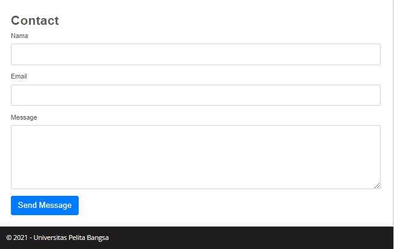